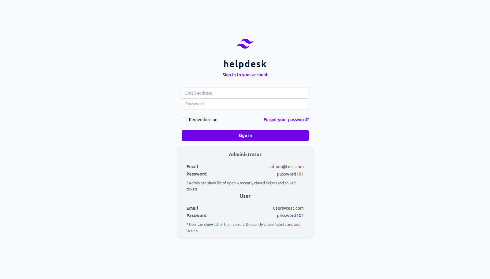
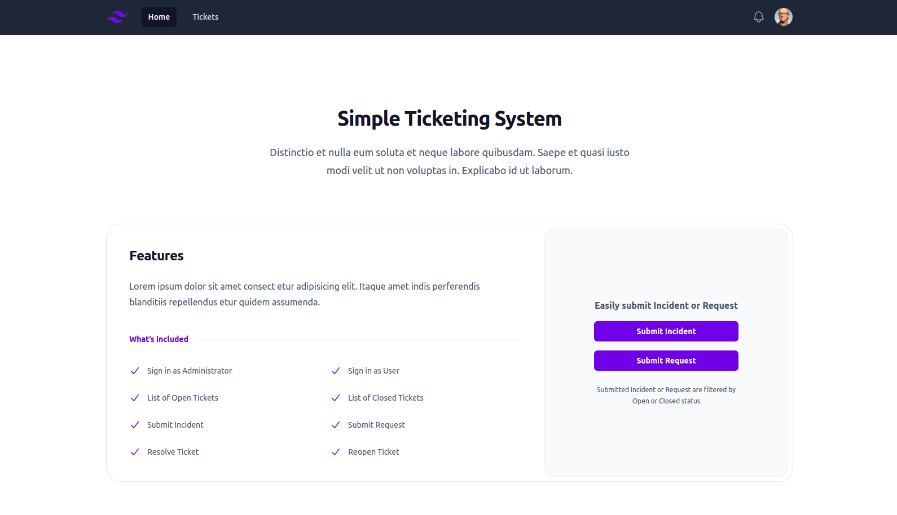
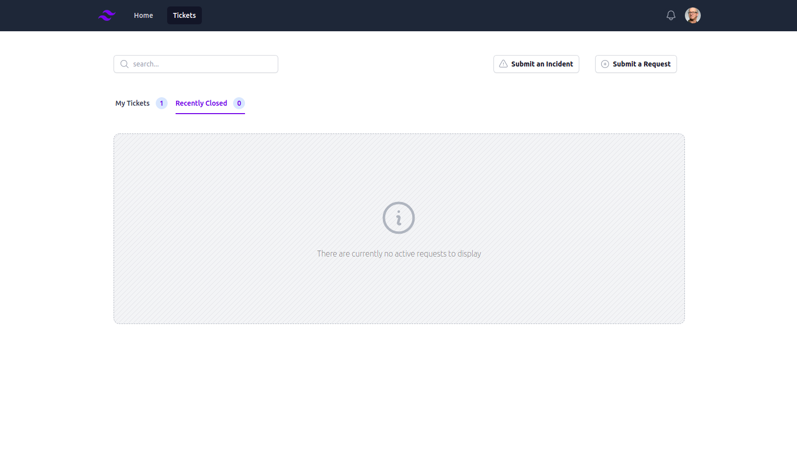
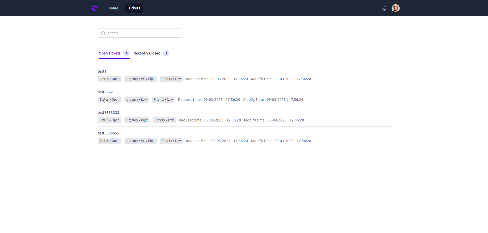
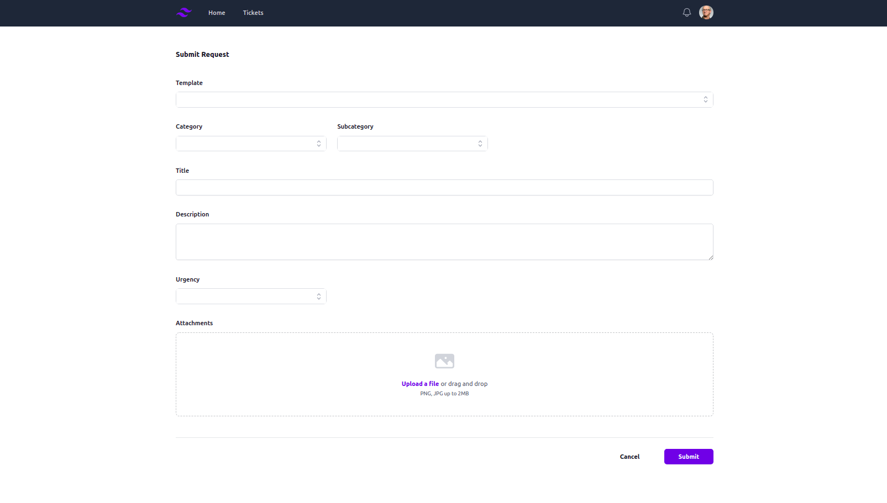
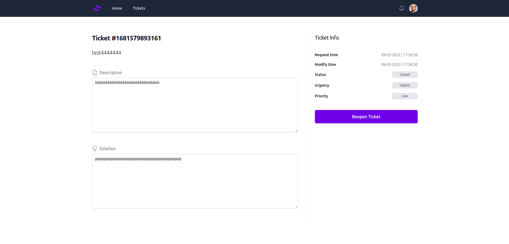
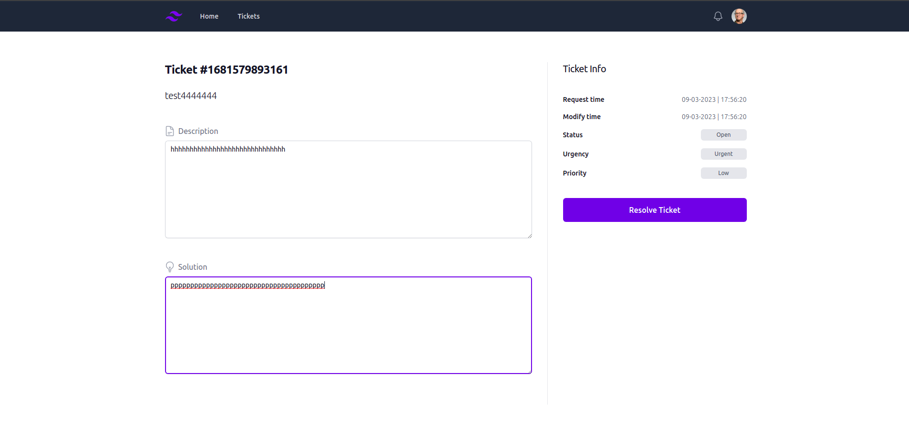

# helpdesk (Simple Ticketing System)

## Vue 3 + TypeScript + TailwindCSS + Vite

* Vue 3
* Typescript
* Tailwind CSS
* Vite


<!-- WEBSITE SCREENSHOT -->










## Build Setup

```bash
# install dependencies
$ npm install

# serve with hot reload at localhost:3000
$ npm run dev

# build for production and launch server
$ npm run build
```